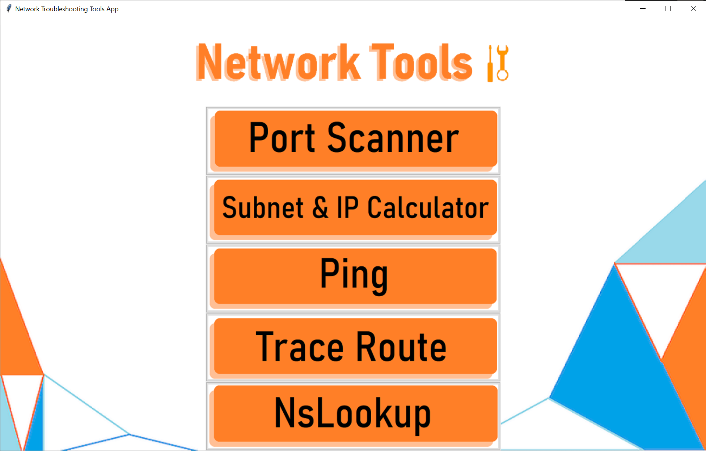

# 3670 Final Project
Submission for group 11

## Test cases

Refer to the report pdf "3670FinalReport.pdf" for test cases and screenshots.

## How to run?

### Step 1
Clone this repository into your local machine by entering the following line in your terminal

```bash
git clone https://github.com/NitinR99/3670FinalProject.git
```
### Step 2

Navigate to the src folder on your terminal and enter this command to start the program

```bash
python main.py
```
After running this command, a new window will open and it will look like this




